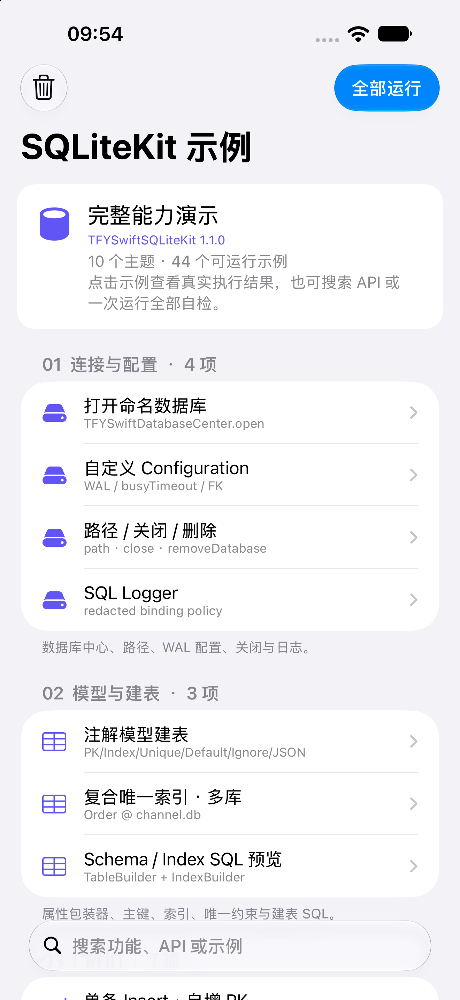

<!--
//
//  README.md
//  TFYSwiftSQLiteKit
//
//  Created by 田风有 on 2021/5/9.
//
-->

# TFYSwiftSQLiteKit

**用 Swift 模型管理 SQLite，让明文存储与 SQLCipher 加密使用同一套接口。**

Model-first SQLite for Swift, with optional SQLCipher encryption.

[](#环境要求)
[](#sqlcipher-加密)
[](LICENSE)

TFYSwiftSQLiteKit 是基于 Foundation 与 SQLite C API 的轻量同步 ORM。通过 `Codable` 模型和属性包装器定义数据，完成建表、CRUD、索引、事务与迁移；需要保护本地文件时，再启用 SQLCipher 后端，继续使用原有模型与查询代码。

**当前版本：`1.1.0`**。GitHub Release 与 CocoaPods 均已发布，可通过 SwiftPM 或 CocoaPods 接入。正式 tag 已通过两种后端的四平台编译、导入及 macOS RuntimeTests 验证。发布与验证结果见 [验证记录](docs/Validation.md)。

[快速上手](#快速上手) · [安装](#安装) · [加密接入](#sqlcipher-加密) · [体验 Demo](#体验-demo) · [常见问题](#常见问题)

## 为什么选择它

- **模型即表结构**：普通属性自动映射，主键、索引、默认值与 JSON 列通过包装器声明，减少重复 SQL。
- **按需选择加密**：默认系统 SQLite；SQLCipher 与明文模式共享模块名、模型、CRUD、查询和迁移接口。
- **常用能力配套提供**：批量写入、分页、嵌套事务、预编译语句、逐行读取、备份、checkpoint 与完整性检查。
- **迁移结果可检查**：返回实际执行的 SQL 和警告；迁移在事务中完成，失败时回滚。
- **支持独立接入**：运行时不依赖 UIKit，UIKit / SwiftUI App 与其他 Apple 平台项目可通过 CocoaPods 或 SwiftPM 集成。
- **有可运行的学习入口**：44 个交互式 Demo 和 59 项测试，涵盖普通存储与真实加密行为。验证范围见 [本地验证记录](docs/Validation.md)。

适合离线笔记、收藏与阅读记录、业务数据缓存、可查询的本地配置、多数据库隔离，以及需要文件加密的本地数据。运行时不采集数据、不发起网络请求；两种分发方式均包含 `PrivacyInfo.xcprivacy`。

更多架构细节与接入范围见 [能力与边界](#能力与边界)。

## 阅读导航

| 你想完成的事 | 从这里开始 |
| --- | --- |
| 第一次接入并保存一条数据 | [环境要求](#环境要求) → [安装](#安装) → [快速上手](#快速上手) |
| 定义列、索引、JSON 与自定义 CodingKeys | [模型与字段](#模型与字段) |
| 批量写入、分页、条件查询和删除 | [CRUD 与批量操作](#crud-与批量操作)、[查询与分页](#查询与分页) |
| 管理事务、库名、配置与连接生命周期 | [事务](#事务)、[数据库配置与多库隔离](#数据库配置与多库隔离) |
| 为已有数据库升级表结构 | [迁移与版本升级](#迁移与版本升级) |
| 加密、换钥、转换旧文件 | [SQLCipher 加密](#sqlcipher-加密) |
| 备份、校验文件或执行原始 SQL | [备份与完整性检查](#备份与完整性检查)、[底层连接与预编译语句](#底层连接与预编译语句) |
| 排查接入问题或参与维护 | [常见问题](#常见问题)、[验证与参与贡献](#验证与参与贡献) |

## 环境要求

| 项目 | 最低要求 |
| --- | --- |
| iOS / iPadOS | 16.0 |
| macOS | 13.0 |
| tvOS | 16.0 |
| watchOS | 9.0 |
| SwiftPM Standard 明文模式 | Swift 5.9+ |
| SwiftPM SQLCipher trait | Swift 6.1+，使用 `Package@swift-6.1.swift` |
| CocoaPods | Podspec 声明 Swift 5.9；按所选后端安装 |
| 库产品与导入名 | `TFYSwiftSQLiteKit` |

所有平台下限已同步到两份 Package、Podspec、SQLCipher 示例与部署目标校验；CocoaPods 的 macOS RuntimeTests 也使用 macOS 13。示例 iOS App 最低支持 iOS 16。

## 安装

### Swift Package Manager

**Xcode App：**

1. 打开 **File → Add Package Dependencies**。
2. 输入 `https://github.com/13662049573/TFYSwiftSQLite.git`。
3. 选择 `1.1.0` 或兼容的更新版本，添加产品 **TFYSwiftSQLiteKit**。
4. 在使用位置添加 `import TFYSwiftSQLiteKit`。

**其他 Swift Package：**

在现有 `Package.swift` 的 `dependencies` 与目标依赖中添加：

```swift
dependencies: [
    .package(
        url: "https://github.com/13662049573/TFYSwiftSQLite.git",
        from: "1.1.0"
    )
],
targets: [
    .target(
        name: "YourFeature",
        dependencies: [
            .product(name: "TFYSwiftSQLiteKit", package: "TFYSwiftSQLite")
        ]
    )
]
```

默认使用系统 SQLite。需要加密时，按 [SQLCipher 加密](#sqlcipher-加密) 启用 trait。

**本地修改或调试库时：**

将远端依赖换成本地路径，并使用对应的 package 名称：

```swift
// dependencies
.package(name: "TFYSwiftSQLiteKit", path: "../TFYSwiftSQLite"),

// YourFeature 的 dependencies
.product(name: "TFYSwiftSQLiteKit", package: "TFYSwiftSQLiteKit"),
```

### CocoaPods

在 App 的 `Podfile` 中添加：

```ruby
platform :ios, '16.0'

target 'YourApp' do
  use_frameworks!
  pod 'TFYSwiftSQLiteKit', '~> 1.1.0'
end
```

然后执行 `pod install`，使用生成的 `.xcworkspace` 打开项目。

不指定 subspec 时默认使用 `Standard`，也可显式选择：

```ruby
pod 'TFYSwiftSQLiteKit/Standard', '~> 1.1.0'
```

本地修改或调试时，将版本依赖替换为 `pod 'TFYSwiftSQLiteKit/Standard', :path => '../TFYSwiftSQLite'`。

若更新索引后仍找不到 `1.1.0`，或当前网络访问 CocoaPods CDN 返回 403，可在 Podfile 顶部添加官方 Git Specs 源，再执行 `pod install --repo-update`：

```ruby
source 'https://github.com/CocoaPods/Specs.git'
```

需要加密时选择 `TFYSwiftSQLiteKit/SQLCipher`；**Standard 与 SQLCipher 只选一个，避免同时接入两套后端**。详见 [后端选择](#1-选择加密后端)。

## 快速上手

以下示例定义一个可查询、可更新的笔记模型。完整复制两段代码即可体验；在 App 中，把数据库操作放进业务的数据层或后台执行器。

### 1. 定义模型

```swift
import Foundation
import TFYSwiftSQLiteKit

struct Note: TFYSwiftDBModel {
    @TFYPrimaryKey(autoIncrement: true)
    var id: Int = 0

    @TFYIndex
    var title: String = ""

    var content: String = ""
    var isPinned: Bool = false
    var createdAt: Date = Date()
    var archivedAt: Date? = nil

    static var tableName: String { "notes" }
    static var databaseName: String { "notes_app" }
}
```

模型遵循 `Codable` 并具备 `init()`。示例通过属性初始值获得无参数初始化，表名与库名显式固定，避免重命名 Swift 类型时改变存储位置。

### 2. 建表、写入并读取

```swift
func runNoteExample() throws {
    let report = try Note.createTable()
    print("建表或迁移有变更：", report.hasChanges)

    var draft = Note()
    draft.title = "第一条笔记"
    draft.content = "SQLite 与 Swift 模型一起使用"

    let rowID = try draft.insertReturningRowID()

    if var saved = try Note.fetch(byPrimaryKey: rowID) {
        saved.isPinned = true
        try saved.update()
        print("已更新：", saved.id, saved.title)
    }

    let recent = try Note.fetchAll(
        Note.query()
            .where(Note.fields.isPinned == true)
            .orderBy(Note.fields.createdAt.descending())
            .limit(20)
    )
    print("置顶笔记：", recent.map(\.title))
}
```

在合适的位置调用 `try runNoteExample()`，并处理错误。

**自增主键不会回写到原模型。** `insertReturningRowID()` 返回 SQLite rowID；在本例的 INTEGER 主键中它也是生成的主键值。更新、删除时使用读回的模型，或将已确认的主键设置到模型。原始 `insert()` 也不会把 `id = 0` 自动改成新 ID。

`createTable()` 是显式入口，CRUD 不会自动创建表。首次使用和模型升级时执行建表/迁移，再开始业务读写。

## 模型与字段

### 属性包装器速查

| 声明 | 用途 | 示例 |
| --- | --- | --- |
| 普通属性 | 自动映射为 SQLite 列 | `var title = ""` |
| `@TFYPrimaryKey` | 单列主键 | `@TFYPrimaryKey var key = ""` |
| `@TFYPrimaryKey(autoIncrement: true)` | INTEGER 自增主键 | `@TFYPrimaryKey(autoIncrement: true) var id = 0` |
| `@TFYIndex` | 普通索引 | `@TFYIndex var title = ""` |
| `@TFYUnique` | 唯一索引 | `@TFYUnique var email = ""` |
| `@TFYDefault(...)` | SQL 默认值，供迁移/省略列的 SQL 使用 | `@TFYDefault("guest") var role = "guest"` |
| `@TFYIgnore` | 不参与数据库持久化 | `@TFYIgnore var isSelected = false` |
| `@TFYColumn(name:)` | 自定义数据库列名 | `@TFYColumn(name: "display_name") var displayName = ""` |
| `@TFYColumn(storageStrategy: .json)` | 把 Codable 值存为 JSON TEXT | `@TFYColumn(storageStrategy: .json) var tags: [String] = []` |

`@TFYColumn` 也可集中声明 `primaryKey`、`autoIncrement`、`indexed`、`unique`、`defaultValueSQL` 与 `ignored` 等选项。

注意三个容易混淆的地方：

- `var role = "guest"` 是 Swift 初始化值，不会自动生成 SQL `DEFAULT`；需要数据库默认值时显式声明 `@TFYDefault("guest")`。
- ORM 插入会绑定模型当前值；SQL 默认值不会覆盖已绑定的值。
- `@TFYIgnore` 只控制数据库持久化，不等同于忽略 Codable 的 JSON 编码。未持久化的属性在读取模型时保留 `init()` 对应的默认值。

### 支持的类型

| Swift 类型 | SQLite 存储 | 说明 |
| --- | --- | --- |
| `Int` / `Int8...Int64`、`UInt` / `UInt8...UInt64` | INTEGER | 无符号值必须在 `Int64` 范围内 |
| `Bool` | INTEGER | 使用 0 / 1；非法布尔数据读取时报错 |
| `Double` / `Float` | REAL | 不接受 NaN 与无穷值 |
| `String` | TEXT | 文本中的 NUL 通过绑定值保存 |
| `Data` | BLOB | 支持空 Data |
| `Date` | REAL | 存储 `timeIntervalSinceReferenceDate`，并非 Unix 时间戳 |
| 上述类型的 Optional | 对应类型 / NULL | 可选属性允许 NULL |
| Codable 对象、数组、字典或 JSON 标量 | TEXT | 必须选择 `.json` |

非可选属性会生成 `NOT NULL`。如果已有数据库含不符合模型的数据，读取会明确报错；建议先修复数据或设计迁移，不依赖静默转换。

### JSON 与忽略字段

```swift
struct Attachment: Codable {
    var filename: String = ""
    var byteCount: Int = 0
}

struct Document: TFYSwiftDBModel {
    @TFYPrimaryKey(autoIncrement: true)
    var id: Int = 0

    var title: String = ""

    @TFYColumn(storageStrategy: .json)
    var attachment: Attachment = Attachment()

    @TFYColumn(storageStrategy: .json)
    var tags: [String] = []

    @TFYIgnore
    var isSelected: Bool = false

    static var databaseName: String { "documents_app" }
}
```

JSON 列适合整体读写的结构化值。动态字段查询不会自动展开嵌套 JSON 属性；需要针对内部字段查询时，用绑定参数与受信任的 SQLite JSON SQL 表达式。

### 复合索引

例如同一账号内，一个服务端记录 ID 只能出现一次：

```swift
struct RemoteRecord: TFYSwiftDBModel {
    @TFYPrimaryKey(autoIncrement: true)
    var id: Int = 0

    var ownerID: String = ""
    var remoteID: String = ""
    var payload: String = ""

    static var databaseName: String { "sync_app" }

    static var compositeIndexes: [TFYCompositeIndex] {
        [
            TFYCompositeIndex(
                columns: ["ownerID", "remoteID"],
                unique: true,
                name: "uidx_remote_owner_record"
            )
        ]
    }
}
```

索引名在整个数据库中必须唯一。索引列可引用模型属性名或已声明的数据库列名，构建 schema 时会校验。已有同名索引定义不匹配时，迁移会报错并回滚。

### 自定义 CodingKeys

属性名、数据库列名与 Codable key 可以不同。`databaseCodingKeys` 映射的是 **Swift 属性名 → Codable key**：

```swift
struct Profile: TFYSwiftDBModel {
    @TFYPrimaryKey(autoIncrement: true)
    var id: Int = 0

    @TFYColumn(name: "db_label")
    var label: String = ""

    static var databaseName: String { "profiles_app" }

    static var databaseCodingKeys: [String: String] {
        ["label": "json_label"]
    }

    enum CodingKeys: String, CodingKey {
        case id
        case label = "json_label"
    }
}
```

默认合成 Codable 不需要此映射。显式排除持久化属性或使用自定义编码结构时，应检查模型是否仍能编码为顶层键值对象。

## CRUD 与批量操作

以下示例复用上面的 `Note`，并假定已完成 `Note.createTable()`。

### 插入与批量插入

```swift
var note = Note()
note.title = "待处理"
let rowID = try note.insertReturningRowID()

let batch = (0..<100).map { index in
    var item = Note()
    item.title = "批量笔记 \(index)"
    item.content = "批量写入会在事务中复用预编译语句"
    return item
}
try Note.insert(batch)
```

批量写入整体事务化，其中一条失败时整批回滚。`insertReturningRowID()` 原子执行写入并获取 rowID；不要在并发插入后再分开读取 `lastInsertedRowID` 来关联某一条记录。

### 更新、upsert 与 replace

```swift
if var saved = try Note.fetch(byPrimaryKey: rowID) {
    saved.content = "新的内容"
    try saved.update()

    saved.isPinned = true
    try saved.upsert()
}
```

| 方法 | 行为 | 使用场景 |
| --- | --- | --- |
| `insert()` | 插入新行；约束冲突报错 | 明确创建新记录 |
| `update()` | 按模型当前主键更新 | 已知主键的记录修改 |
| `upsert()` | 按主键 `ON CONFLICT DO UPDATE` | 主键存在则更新，否则插入 |
| `insertOrReplace()` | SQLite `INSERT OR REPLACE` | 明确接受冲突行被删除后再插入的语义 |

`upsert` 需要主键，冲突目标是主键，不是任意唯一索引。自增主键仍为 0 时，会省略它并插入新行。`insertOrReplace` 可能触发删除相关的外键级联；需要保留关联行时优先评估 `upsert`。

`update()` 和 `delete()` 不以“影响行数为零”作为找不到记录的错误。需要确认实际修改情况时，在业务事务中检查 `connection.changes` 或先检查是否存在。

### 删除

```swift
try Note.delete(byPrimaryKey: rowID)

let archived = Note.fields.archivedAt.isNotNull()
try Note.delete(Note.query().where(archived))
```

模型实例也可调用 `saved.delete()`。基于 `TFYQuery` 的删除必须有谓词；空查询会被拒绝。

**`delete(query)` 只使用 WHERE 条件，忽略排序与分页。** 不要用 `.limit(1)` 期望只删除一条；删除单条记录请使用明确主键。

## 查询与分页

### 动态字段与显式类型字段

```swift
let pinned = try Note.fetchAll(
    Note.query()
        .where(Note.fields.isPinned == true)
        .orderBy(Note.fields.createdAt.descending())
)

let titleField = Note.field("title", as: String.self)
let named = try Note.fetchAll(
    Note.query().where(titleField == "第一条笔记")
)
```

`Note.fields.title` 支持动态成员语法，字段名在运行时验证；`field("title", as: String.self)` 可约束比较值的 Swift 类型。两者都不是编译期生成的 KeyPath schema，拼写错误会在执行查询时抛出错误。

### 组合条件、IN、NULL 与文本匹配

```swift
let titleMatches = Note.fields.title.contains("Swift")
let active = Note.fields.archivedAt.isNull()
let condition = (Note.fields.isPinned == true || titleMatches) && active

let matching = try Note.fetchAll(
    Note.query().where(condition)
)

let selectedIDs = try Note.fields.id.in([1, 2, 3])
let selected = try Note.fetchAll(
    Note.query().where(selectedIDs)
)
```

- `&&`、`||` 和 `!` 对应 AND、OR 与 NOT。
- `isNull()` / `isNotNull()` 明确表达 NULL 判断；与 nil 的等号/不等号比较也会转成 IS NULL / IS NOT NULL。
- `in([])` 会报错，业务可在列表为空时直接返回空结果。
- `contains` / `starts(with:)` 按字面量处理 `%`、`_` 和 `\`。
- `like("Swift%")` 允许自行使用 SQL 通配符。

### 分页、计数与存在性

```swift
let page = try Note.fetchAll(
    Note.query()
        .where(Note.fields.archivedAt.isNull())
        .orderBy(Note.fields.createdAt.descending(), Note.fields.id.descending())
        .limit(20, offset: 40)
)

let total = try Note.count(
    Note.query().where(Note.fields.archivedAt.isNull())
)
let hasPinned = try Note.exists(
    Note.query().where(Note.fields.isPinned == true)
)
```

分页 limit 必须大于 0，offset 必须大于等于 0。建议使用包含主键的稳定排序，避免同一排序值的记录顺序不确定。

`count(query)` 与 `exists(query)` 只使用谓词，忽略 ORDER BY / LIMIT / OFFSET；`count` 得到所有匹配记录的数量，不是当前页条数。

### 原始条件与绑定参数

```swift
let searchTitle = "第一条笔记"
let rows = try Note.fetchAll(
    where: "\"title\" = ? AND \"isPinned\" = ?",
    bindings: [.text(searchTitle), .integer(1)]
)

let rawPage = try Note.fetchPage(
    where: "\"archivedAt\" IS NULL",
    orderBy: "\"createdAt\" DESC, \"id\" DESC",
    limit: 20,
    offset: 0
)
```

`where` 参数只传条件，不要再加 `WHERE`。业务值用绑定参数，`orderBy`、表/列标识符及表达式来自受信任的代码；占位符不能代替 SQL 标识符。

## 事务

### 同库原子写入

```swift
let createdIDs = try Note.transaction {
    var first = Note()
    first.title = "事务中的第一条"

    var second = Note()
    second.title = "事务中的第二条"

    return [
        try first.insertReturningRowID(),
        try second.insertReturningRowID()
    ]
}
```

事务闭包可以返回结果。闭包抛出错误会回滚；嵌套事务通过 savepoint 实现。

`Note.transaction` 只管理 `Note.databaseName` 对应的连接。其他数据库的模型调用不属于同一个事务，不能把它当成跨文件的原子事务。

### 失败回滚

```swift
enum ImportFailure: Error {
    case cancelled
}

let before = try Note.count()
do {
    try Note.transaction {
        var pending = Note()
        pending.title = "这条不会保留"
        try pending.insert()
        throw ImportFailure.cancelled
    }
} catch ImportFailure.cancelled {
    print("导入取消，事务已回滚")
}
let after = try Note.count()
assert(before == after)
```

同一连接在整个事务闭包期间持有递归锁，其他线程等待事务完成。事务里可以继续调用同库模型 API，但不要等待另一个线程完成同库操作，否则可能互相等待。

不在事务内执行网络等待或耗时 UI 工作。手动 SQL `BEGIN` 启动的事务须由调用者提交/回滚，结束后才能使用 `withTransaction`。

## 数据库配置与多库隔离

### 配置一次，模型共用

在该数据库首次访问之前注册：

```swift
let configuration = TFYSwiftDBConfiguration(
    foreignKeysEnabled: true,
    journalMode: .wal,
    synchronousMode: .normal,
    busyTimeout: 8,
    walAutoCheckpoint: 1_000
)
try Note.configureDatabase(configuration)

let report = try Note.createTable()
let connection = try TFYSwiftDatabaseCenter.shared.open(named: Note.databaseName)
```

`configureDatabase` 按 `databaseName` 注册。相同库名的所有模型复用配置，包括后续 CRUD、查询、事务、迁移和关闭后重新打开。

| 默认配置 | 值 |
| --- | --- |
| 外键 | 开启 |
| journal mode | WAL |
| synchronous | NORMAL |
| busy timeout | 5 秒 |
| WAL auto checkpoint | 1,000 页 |

`busyTimeout` 是锁等待时间，不是通用查询超时或任务取消。持久性要求更高时可评估 `.full`，再根据实际设备与负载测试性能。

### 多数据库与存储位置

不同 `databaseName` 对应不同文件；默认位置为：

```text
Library/TFYSwiftSQLite/<databaseName>.db
```

```swift
let center = TFYSwiftDatabaseCenter.shared
let path = try center.path(named: Note.databaseName)
print(path)
```

库名使用稳定的文件安全名称，不带路径分隔符、`..`、控制字符或首尾空白。模型未声明时默认库名为 `default`，表名为 Swift 类型名转小写。

账户或业务隔离可通过不同库名设计。模型 schema 会缓存，建议模型静态声明保持稳定；频繁修改静态库名不适合作为隐式账户上下文。需要运行时任意路径/容器时，直接创建底层连接，并由业务数据层管理。

### 关闭、重新配置与删除

```swift
let center = TFYSwiftDatabaseCenter.shared

guard center.close(named: Note.databaseName) else {
    throw TFYSwiftDBError.invalidConfiguration("仍有活跃事务或预编译语句")
}
try Note.configureDatabase(nil) // 清除中心注册配置，包括它持有的密钥
```

- 普通关闭保留注册配置，重开会复用它。
- `close(named:)` 返回实际关闭结果；有存活语句或本线程活跃事务时可能失败，连接仍保留。
- 其他线程发起关闭/删除时，会先等待正在执行的连接事务结束。
- `closeAll()` 尝试关闭缓存连接；需要逐库确认结果时用 `close(named:)`。
- 更换配置应先确认关闭成功，再注册新配置。
- `removeDatabase(named:)` 会关闭并删除数据库及 WAL / SHM / journal 文件，同时移除注册配置。这是删除数据操作，不是普通退出动作。

切换账户、替换数据库或关闭数据层时，应先停止新的业务请求，完成已有操作，再关闭文件。

## 迁移与版本升级

### .safe 与迁移报告

默认 `.safe` 对 SQLite 可原地处理的新增列和索引进行迁移：

```swift
let report = try Note.createTable()
print(report.formattedLines().joined(separator: "\n"))

if !report.warnings.isEmpty {
    // 将这些警告交给数据层判断，决定是否需要显式升级。
    print("待处理的 schema 差异：", report.warnings)
}
```

`hasChanges` 表示是否实际执行了结构变更，不表示“所有差异均已修复”。类型变化、删列等不能安全原地完成的差异可能只写入 `warnings`，原表继续保留。

迁移报告同时写入 `__tfy_schema_journal`，便于查看表名、模型、schema 签名与最近一次报告。

### 为已有表新增字段

在模型中增加字段时，根据历史数据选择可选值或数据库默认值：

```swift
// 放在模型内，二选一或按实际业务使用：
var subtitle: String? = nil

@TFYDefault("inbox")
var category: String = "inbox"
```

向非空表新增非可选且无 SQL 默认值的字段，`.safe` 会报错并回滚。Swift 属性的初始值不能替历史记录补数据。

### 重命名与重建

以下模型描述一个旧版本 `name` 字段升级到 `displayName` 的过程。两版本使用相同库名和表名：

```swift
struct ContactV1: TFYSwiftDBModel {
    @TFYPrimaryKey(autoIncrement: true)
    var id: Int = 0

    var name: String = ""

    static var tableName: String { "contacts" }
    static var databaseName: String { "contacts_app" }
}

struct ContactV2: TFYSwiftDBModel {
    @TFYPrimaryKey(autoIncrement: true)
    var id: Int = 0

    var displayName: String = ""

    static var tableName: String { "contacts" }
    static var databaseName: String { "contacts_app" }
    static var migrationPolicy: TFYMigrationPolicy { .rebuildTable }

    static func renamedColumns(
        for schema: TFYSwiftModelSchema,
        existingColumns: [TFYSQLiteTableColumnInfo]
    ) throws -> [String: String] {
        // 已升级的库不再声明不存在的旧字段。
        existingColumns.contains { $0.name == "name" }
            ? ["displayName": "name"]
            : [:]
    }
}
```

调用 `ContactV2.createTable()` 后，旧 `name` 的值复制到 `displayName`。映射使用 **新数据库列名 → 旧数据库列名**，需根据 `existingColumns` 返回，避免重开时重复引用已移除的字段。

需要数据转换时，可在新版模型中进一步实现：

```swift
static func rebuildExpressions(
    for schema: TFYSwiftModelSchema,
    existingColumns: [TFYSQLiteTableColumnInfo]
) throws -> [String: String] {
    guard existingColumns.contains(where: { $0.name == "name" }) else {
        return [:]
    }
    return ["displayName": "TRIM(\"name\")"]
}
```

自定义表达式优先于默认复制/重命名逻辑，应由受信任的迁移代码构建。也可通过 `willMigrate`、`didMigrate`、`willRebuildTable`、`validateRebuiltTable` 和 `didRebuildTable` 扩展流程；`validateRebuiltTable` 可检查临时表并抛错回滚。

重建会保留可恢复的触发器、外部索引和 AUTOINCREMENT 历史序列；不兼容定义不会被静默丢弃。以下情况需要应用显式迁移：

- 存在进入/离开目标表的外键依赖。
- 数据库包含视图。
- 目标表含 ORM 未建模的原始 SQL UNIQUE / CHECK、排序规则、生成列、复合主键、STRICT 或 WITHOUT ROWID 等定义。
- 恢复索引或编译触发器失败。

发布升级前，用真实数据副本备份、演练迁移、检查报告与数据，再安排应用升级。自动结构迁移不代替应用的版本化业务迁移队列。

## SQLCipher 加密

启用加密分为两步：**选择 SQLCipher 后端**，再**为指定数据库提供密钥**。只安装 SQLCipher 不会自动加密所有文件；未配置密钥的连接仍可访问明文库。

### 1. 选择加密后端

| 集成方式 | 配置 | 当前使用的引擎 |
| --- | --- | --- |
| SwiftPM Standard | 默认配置 | 系统 SQLite |
| SwiftPM SQLCipher | Swift 6.1+，`SQLCipher` trait | 官方 SQLCipher 4.19.0 xcframework |
| CocoaPods Standard | 默认或 `/Standard` | 系统 SQLite |
| CocoaPods SQLCipher | `/SQLCipher` subspec | 官方 SQLCipher 4.10.0 源码 |

**SwiftPM：** 将宿主 manifest 的工具链版本提升到 `// swift-tools-version: 6.1`，再选择 trait：

```swift
.package(
    url: "https://github.com/13662049573/TFYSwiftSQLite.git",
    from: "1.1.0",
    traits: ["SQLCipher"]
),
```

本地体验：

```swift
.package(
    name: "TFYSwiftSQLiteKit",
    path: "../TFYSwiftSQLite",
    traits: ["SQLCipher"]
),
```

产品和 `import TFYSwiftSQLiteKit` 均不变。Xcode 支持 package traits 的版本可在包设置中选择；仓库 Demo 通过 [Examples/SQLCipherDemo](Examples/SQLCipherDemo/Package.swift) 包装 Package 启用 trait，可参考其集成方式。底层桥接只处理 key/rekey，不需要给消费方添加 unsafe Swift 编译标志。

**CocoaPods：** 将 Standard 依赖替换为：

```ruby
pod 'TFYSwiftSQLiteKit/SQLCipher', '~> 1.1.0'
# 本地调试：pod 'TFYSwiftSQLiteKit/SQLCipher', :path => '../TFYSwiftSQLite'
```

两个加密分发版本默认使用 SQLCipher 4 文件格式；引擎版本不同，重要存量数据仍需在实际宿主中演练兼容性。加密目标不额外链接系统 `sqlite3`，宿主其他数据库依赖也应统一后端，避免同进程 SQLite 同名 C 符号覆盖。

<details>
<summary><strong>Xcode 27 + CocoaPods：SQLCipher 部署目标配置</strong></summary>

SQLCipher 4.10.0 Pod 及其 Privacy bundle 原始部署目标低于 Xcode 27 SDK 支持范围。在宿主已有 `post_install` 中合并以下设置，仅提升 SQLCipher 相关目标：

```ruby
post_install do |installer|
  minimums = {
    'IPHONEOS_DEPLOYMENT_TARGET' => '16.0',
    'MACOSX_DEPLOYMENT_TARGET' => '13.0',
    'TVOS_DEPLOYMENT_TARGET' => '16.0',
    'WATCHOS_DEPLOYMENT_TARGET' => '9.0'
  }

  installer.pods_project.targets.each do |target|
    next unless target.name == 'SQLCipher' || target.name.start_with?('SQLCipher-')

    target.build_configurations.each do |config|
      minimums.each do |setting, minimum|
        current = config.build_settings[setting]
        if current && Gem::Version.new(current) < Gem::Version.new(minimum)
          config.build_settings[setting] = minimum
        end
      end
    end
  end
end
```

已有 `post_install` 时合并内容，不另建重复 hook。仓库的 [sqlcipher_platforms.rb](Scripts/sqlcipher_platforms.rb) 提供同等逻辑；本地/远端校验和发布脚本应用相同设置，保留编译、导入与可用 RuntimeTests，不修改官方源码。

</details>

### 2. 首次访问前注册密钥

以下函数接收由 App Keychain 管理逻辑读取的口令；示例不会替你生成或持久化密钥：

```swift
func prepareEncryptedNotes(passphraseFromKeychain: String) throws {
    guard TFYSwiftDBConnection.supportsEncryption else {
        throw TFYSwiftDBError.encryptionUnavailable
    }

    let key = try TFYSwiftDBKey(passphrase: passphraseFromKeychain)
    let encryption = TFYSwiftDBEncryption(key: key)
    let configuration = TFYSwiftDBConfiguration(encryption: encryption)

    try Note.configureDatabase(configuration)
    try Note.createTable()

    let connection = try TFYSwiftDatabaseCenter.shared.open(named: Note.databaseName)
    print("SQLCipher：", try connection.cipherVersion() ?? "unavailable")
}
```

这是首次创建加密 `notes_app` 数据库的流程。若之前已运行明文快速示例，该文件已经存在，应使用 [已有文件转换](#4-已有明文文件转换与解密)；不能直接为已有明文文件设置密钥。

配置成功后，`Note.insert` / `fetchAll` / `transaction` / `createTable` 使用同一个加密连接，不需要重新定义模型。相同库名的其他模型也共享该配置。

库在首次读取 schema 和配置 WAL 前设置密钥，并立即验证能否读取数据库。错误密钥、格式不符或文件损坏会拒绝打开；未启用后端时传入密钥，会在创建文件前抛出 `encryptionUnavailable`。

### 3. 密钥形式与轮换

| 密钥形式 | API | 说明 |
| --- | --- | --- |
| 字符串口令 | `TFYSwiftDBKey(passphrase:)` | UTF-8 字节口令，可包含 NUL |
| 二进制口令 | `TFYSwiftDBKey(bytes:)` | 非空字节，仍使用 SQLCipher 口令派生 |
| 随机原始密钥 | `TFYSwiftDBKey(rawKey:salt:)` | 32 字节 key；可附加 16 字节 salt |

密钥对象的描述和反射脱敏；库提供的 key、rekey 与导出密钥绑定绕过 SQL logger，包括 `.full`。App 自己在原始 SQL 或日志中写入口令，仍由 App 负责避免泄露。

```swift
func rotateNotesKey(newPassphraseFromKeychain: String) throws {
    let key = try TFYSwiftDBKey(passphrase: newPassphraseFromKeychain)
    try TFYSwiftDatabaseCenter.shared.rekey(named: Note.databaseName, key: key)
    // 成功后按 App 的恢复方案更新 Keychain，并验证重新打开。
}
```

`rekey` 用于已加密数据库，不用于把明文库变成加密库。轮换前结束事务并释放 prepared statements。中心会记住成功轮换后的配置，模型调用及关闭重开使用新密钥。

持久密钥、账户关联和恢复策略由宿主管理。数据库换钥与 Keychain 更新不是跨介质原子事务；应在更新流程中保留必要的恢复信息，验证重开后再淘汰旧密钥。Swift String/Data 的复制与生命周期也不能承诺内存安全擦除。

### 4. 已有明文文件转换与解密

以下函数通过 SQLCipher 后端读取明文源，并导出到一个**尚不存在的新文件**：

```swift
func encryptExistingFile(
    sourceURL: URL,
    encryptedURL: URL,
    passphraseFromKeychain: String
) throws {
    let key = try TFYSwiftDBKey(passphrase: passphraseFromKeychain)
    let encryption = TFYSwiftDBEncryption(key: key)

    let source = try TFYSwiftDBConnection(
        path: sourceURL.path,
        databaseName: "conversion-source"
    )
    defer { try? source.close() }

    try source.export(to: encryptedURL, encryption: encryption)
}
```

`encryptedURL` 父目录须已存在。导出保留 schema、数据、索引、触发器及自增序列，并同步 `user_version` / `application_id`；写入后重新打开目标并检查完整性。不会覆盖现有文件，源文件保持原样，失败时清理本次创建的目标。

后续由 App 停止业务读写、关闭相关连接、核对数据与备份，再安排文件切换。导出新文件不会自动改变模型中心的数据库路径。

需要解密时，使用已加密连接显式导出明文：

```swift
try encryptedConnection.export(to: plaintextURL, encryption: nil)
```

目标会变为明文，应按业务决定其保存位置与生命周期。

### 5. SQLCipher 3 文件升级

```swift
func upgradeLegacyFile(
    sourceURL: URL,
    destinationURL: URL,
    oldKey: TFYSwiftDBKey,
    newKey: TFYSwiftDBKey
) throws {
    let legacy = try TFYSwiftDBConnection(
        path: sourceURL.path,
        databaseName: "legacy-source",
        configuration: TFYSwiftDBConfiguration(
            encryption: TFYSwiftDBEncryption(key: oldKey, compatibility: .version3)
        )
    )
    defer { try? legacy.close() }

    try legacy.export(
        to: destinationURL,
        encryption: TFYSwiftDBEncryption(key: newKey, compatibility: .version4)
    )
}
```

支持标准 SQLCipher 3 / 4 参数。SQLCipher 1 / 2、自定义旧 KDF / page-size、共享容器明文头和外部 salt 配置，需要专门的迁移方案。

## 备份与完整性检查

### 一致性备份

```swift
func backupNotes(to destination: URL) throws {
    let connection = try TFYSwiftDatabaseCenter.shared.open(named: Note.databaseName)
    try connection.backup(to: destination)
}
```

目标必须是新文件，父目录已存在：

- 系统 SQLite 明文库使用 SQLite backup API，包含已提交的 WAL 数据。
- 加密连接通过导出创建备份，保留当前密钥与格式；恢复时仍需对应密钥。
- 备份不会保存 Keychain，因此 App 还需管理密钥的备份与恢复策略。
- 不建议直接复制正在使用的 `.db`：新数据可能仍在 `-wal` 中。

### 校验与 checkpoint

```swift
let connection = try TFYSwiftDatabaseCenter.shared.open(named: Note.databaseName)
let result = try connection.integrityCheck()
guard result == ["ok"] else {
    throw TFYSwiftDBError.maintenance("SQLite 完整性检查未通过")
}

if connection.isEncrypted {
    let hmacErrors = try connection.cipherIntegrityCheck()
    guard hmacErrors.isEmpty else {
        throw TFYSwiftDBError.encryption("SQLCipher HMAC 检查未通过")
    }
}

let checkpoint = try connection.checkpoint(.truncate)
print("checkpoint busy：", checkpoint.busy)
```

`integrityCheck()` 健康时返回 `["ok"]`；`cipherIntegrityCheck()` 仅适用于加密连接，健康时返回空数组。checkpoint 支持 `.passive`、`.full`、`.restart`、`.truncate`，`busy` 表示本次可能需要稍后重试。

备份、导出、checkpoint 和 rekey 等维护操作应在无活跃事务、无存活 prepared statements 的状态执行，并在业务后台执行器中安排。

## 底层连接与预编译语句

ORM 之外，可以独立使用连接，指定任意本地路径，或使用 `:memory:`：

```swift
func runRawExample() throws {
    let connection = try TFYSwiftDBConnection(
        path: ":memory:",
        databaseName: "scratch"
    )
    defer { try? connection.close() }

    try connection.execute("""
        CREATE TABLE items(
            id INTEGER PRIMARY KEY AUTOINCREMENT,
            value TEXT NOT NULL
        );
        """)

    // do 作用域结束后释放语句，再关闭或执行维护操作。
    do {
        let statement = try connection.prepare("INSERT INTO items(value) VALUES (?);")
        try connection.execute(statement, bindings: [.text("first")])
        try connection.execute(statement, bindings: [.text("second")])
    }

    let rows = try connection.query(
        "SELECT id, value FROM items WHERE value = ?;",
        bindings: [.text("first")]
    )
    print(rows)

    let count = try connection.scalar("SELECT COUNT(*) FROM items;")
    print(count as Any)

    try connection.forEachRow("SELECT id, value FROM items ORDER BY id;") { row in
        print(row)
    }
}
```

绑定值支持 `.integer`、`.double`、`.text`、`.blob`、`.null`，或 optional nil。参数数量需与 SQL 占位符一致。

`query(statement, bindings:)` 同样支持复用预编译查询；手动 `bind` / `step` / `row` 时，各方法有锁，但跨方法的整段调用序列仍需业务串行化。`prepare` 创建的语句持有原连接，直到语句释放。

`forEachRow` 不构建完整结果数组，适合逐行处理。回调期间持有连接锁，不要等待另一线程完成同连接操作。ORM 的 `fetchAll` 仍返回完整模型数组。

每次调用只允许一条可执行 SQL；多语句请在 `withTransaction` 中逐条执行。SQL 注释允许保留，SQL 文本自身不接受 NUL，业务文本应绑定。

连接还提供 `lastInsertedRowID`、`changes`、`totalChanges`、`tableExists`、`pragmaTableInfo` 与 `pragmaIndexList`。需要把查询变更计数与某次写入对应时，在同一业务事务/串行范围中读取。

## 日志、错误与排查

### SQL 日志

```swift
TFYSwiftDBRuntime.setSQLLogger { event in
    print(
        event.databaseName,
        event.sql,
        event.duration,
        event.succeeded
    )
}

// 不再观测时关闭：
TFYSwiftDBRuntime.setSQLLogger(nil)
```

`event` 包含库名、路径、SQL、绑定描述、耗时、成功状态和错误描述。绑定值默认 `.redacted`；受控开发环境才考虑 `bindingPolicy: .full`。

**脱敏针对绑定值，SQL 文本本身仍可见。** 使用占位符，不把敏感业务值直接拼进 SQL。日志回调同步执行，应轻量处理，避免阻塞、递归查询或等待同连接的其他线程。

### 错误处理

```swift
do {
    _ = try Note.createTable()
} catch let error as TFYSwiftDBError {
    switch error {
    case .encryptionUnavailable:
        print("请启用 SQLCipher 后端")
    case .migrationConflict(let message):
        print("需要处理迁移：", message)
    case .invalidConfiguration(let message):
        print("检查数据库配置：", message)
    default:
        print(error.localizedDescription)
    }
} catch {
    // 同时处理 Codable / Foundation 等其他错误。
    print(error.localizedDescription)
}
```

连接、配置、查询和迁移错误可通过 `TFYSwiftDBError` 分类处理；自定义 Codable/迁移逻辑也可能抛出其他错误，应保留通用处理分支。库没有为所有高层错误公开统一 extended result code。

## 能力与边界

| 能力 | 当前支持 |
| --- | --- |
| 存储 | Foundation 同步运行时，文件与内存连接 |
| 模型 | Codable + init()，标量/Optional/JSON，自定义列与编码键 |
| 查询 | 绑定参数、动态/显式类型字段、组合条件、排序、分页、计数 |
| 写入 | 单条/批量、主键 update/upsert、SQLite replace |
| 一致性 | 同连接串行操作，嵌套事务/savepoint |
| 迁移 | 安全增量迁移、显式重建、校验 hook、迁移日志 |
| 文件维护 | 一致性备份、WAL checkpoint、SQLite/HMAC 校验 |
| 加密 | 可选 SQLCipher，口令/raw key、换钥、明文转换/解密、标准 3→4 升级 |

需要由业务数据层处理的部分：

- API 是同步 IO；没有内置 async/await、任务取消、多连接读池或关系对象图。
- 中心是共享单例，ORM 默认使用 Library 路径；模型不能绑定任意独立 connection/context。自定义路径可用底层连接。
- 不提供复合主键 ORM、外键声明、JSON 嵌套字段的生成查询与任意复杂 schema 的自动重建。
- 行解码经过 SQLite → JSON → Codable，有反射与桥接开销。大数据场景应实测，按需使用分页、批量写入和逐行读取。
- 密钥持久化、账户/Keychain 生命周期、iOS 后台锁、App Group 跨进程与文件切换由宿主负责。

当前本地验证不能代替真机、低空间、大文件、进程中断或实际账户生命周期验收。完整评估见 [库评估与维护计划](docs/LibraryReview.md)。

## 常见问题

### 插入后为什么 id 仍是 0？

ORM 不修改原始模型。用 `insertReturningRowID()` 获取 rowID，再按主键读取模型；不要直接用仍为 0 的对象更新或删除。

### 为什么提示 no such table？

CRUD 不会自动建表。首次访问先调用对应模型的 `createTable()`，并检查 `databaseName`、`tableName` 是否与预期一致。

### 新增属性有 Swift 默认值，为什么迁移仍失败？

Swift 初始值不等于 SQL DEFAULT。非空表新增必填列需要 `@TFYDefault`、可选值，或重建中的有效数据来源。

### 开启 .safe 后为什么字段类型没有改变？

`.safe` 保留不能安全原地修改的结构，并返回警告。检查 `report.warnings`，再选择重建或应用显式迁移；`hasChanges == false` 不表示没有 schema 差异。

### 为什么 close 返回 false？

先释放所有存活的 prepared statements，并结束本线程活跃事务。`prepare` 语句需要真正离开作用域/释放，执行完成并不等于已 finalize。不要在关闭失败后移动或删除文件。

### 为什么出现配置冲突？

同名库已打开，且新配置与现有配置不同。停止业务读写，确认关闭成功，再重新注册。加密配置应在该库第一次访问之前提供。

### 启用 SQLCipher 后，文件为什么仍是明文？

后端提供加密能力，密钥配置决定某个连接是否加密。首次创建前通过 `configureDatabase` 注册 `encryption`；已有明文文件须导出转换。

### encryptionUnavailable 或错误密钥怎样排查？

确认选择了 SQLCipher trait/subspec，而不只是导入模块；再检查实际 `cipherVersion()`、文件路径、密钥字节与 `.version3/.version4` 格式。错误密钥与损坏文件可能都表现为加密读取失败，不要因此自动删除原库。

### SwiftPM 明文模式为什么也可能下载 SQLCipher？

Swift 6.1 manifest 声明了带条件的 SQLCipher 目标依赖，解析阶段可能下载已声明的依赖。trait 控制是否构建/链接加密后端，默认连接实现仍使用系统 SQLite；旧 manifest 只使用系统 SQLite。

### 原始 Codable 的 CodingKeys 可以直接使用吗？

默认合成无需配置；重命名持久属性的编码 key 时，添加 `databaseCodingKeys`。它映射 Swift 属性名到 JSON key，数据库列名单独由 `@TFYColumn(name:)` 决定。

### 查询 limit 能限制 count 或 delete 吗？

不能。`count`、`exists`、`delete` 只使用查询谓词；分页只影响 `fetchAll(query)`。删除一条请按明确主键操作。

### 能直接在 SwiftUI 的 Task 中调用吗？

可以由 App 封装数据层，但这些调用本身同步，不能假定 `Task` 自动把工作移出主线程。安排自己的后台执行器/串行队列或 actor，遵守模型与 UI 的并发隔离。

## 体验 Demo

打开 `TFYSwiftSQLite.xcodeproj`，运行 **TFYSwiftSQLite** scheme。

<p align="center">
  
</p>

<p align="center"><em>真实示例目录：搜索 API、单独运行用例，或一键验证全部能力。</em></p>

Demo 提供可搜索的分组目录、结果页、耗时与复制输出；**Run All** 顺序执行全部 44 个独立示例：

| 主题 | 可以体验的能力 |
| --- | --- |
| 连接与配置 | 库名/路径、WAL、配置、关闭、SQL logger |
| 模型与建表 | 属性包装器、schema 与索引预览、复合唯一索引 |
| CRUD | 单条/批量写入、替换、更新/删除、count/exists/page |
| 查询 | 显式类型字段、动态字段、AND/OR/NOT/IN/LIKE/NULL |
| 类型 | JSON、Bool、Date、Data、忽略字段 |
| 事务 | 原子写入、返回值、回滚、嵌套 savepoint |
| 迁移 | 必填列保护、默认值升级、重建、journal |
| 底层 API | 原始 SQL、语句复用、列读取、变更计数、introspection |
| 性能与诊断 | 写入/读取 benchmark |
| SQLCipher | 引擎版本、加密 ORM、换钥、转换/解密、加密备份 |

设置环境变量 `DEMO_VERIFY=1` 可在启动时自动运行全部示例，结果写入 App Documents/`demo_verify.txt`。“重置”仅删除 Demo 自己管理的数据库。Demo 口令用于演示，生产 App 使用自己的 Keychain 与恢复方案。

## 验证与参与贡献

欢迎通过 [GitHub Issues](https://github.com/13662049573/TFYSwiftSQLite/issues) 反馈接入问题、缺陷和具体功能需求，通过 [Pull Requests](https://github.com/13662049573/TFYSwiftSQLite/pulls) 提交改进。若这个库帮助你减少了本地存储代码，也欢迎 Star 并分享你的使用场景。

反馈时建议附上版本、集成方式/后端、系统与工具链、最小模型、复现步骤和预期/实际结果。去掉口令、用户数据与真实业务文件。

本地验证入口：

```bash
# 源码、资源、测试、文件头、平台和版本一致性
ruby Scripts/validate_distribution_layout.rb

# 两种后端顺序测试，模型测试共用固定的 Library 测试路径
swift test
swift build -c release
swift test --traits SQLCipher --scratch-path .build-sqlcipher
swift build -c release --traits SQLCipher --scratch-path .build-sqlcipher

# CocoaPods 四平台编译/导入；两种后端的 macOS RuntimeTests
ruby Scripts/validate_cocoapods.rb All
```

当前测试共 59 项：Standard 跳过 5 项加密专用检查；SQLCipher 跳过 1 项后端不可用检查。CocoaPods 两种 subspec 提供同一批 macOS RuntimeTests；iOS 行为测试使用 Xcode 测试目标。CI 配置包含双后端、旧 manifest 和 CocoaPods 校验，远端结果以实际运行记录为准。

新增 API/缺陷修复应提供有意义的行为验证；新增库或测试文件时同步 manifest、Podspec 与 Xcode 配置，并运行分发一致性检查。详细平台、工具链和未覆盖范围见 [Validation.md](docs/Validation.md)。

### 仓库结构

```text
TFYSwiftSQLite/TFYSwiftSQLiteKit/
├── Annotation/       # 列注解与属性包装器
├── Core/             # 连接、语句、加密、错误与 SQL 日志
├── Manager/          # 数据库中心与配置/生命周期
├── ORM/              # 模型 API、写入、查询与表构建
├── Reflection/       # 模型反射与 schema
├── Schema/           # 迁移、索引与迁移报告
└── Utils/            # 类型映射与 benchmark

Sources/CTFYSQLCipher/ # SwiftPM 加密桥接
Examples/SQLCipherDemo/
TFYSwiftSQLiteTests/
Scripts/
docs/
```

CocoaPods 与 SwiftPM 使用同一份完整 Swift 运行时源码与 Privacy Manifest。Demo 是独立消费者，库不需要引入 UIKit 示例代码。

## 版本历史与发布

### 1.1.0 · 已发布

- 平台下限统一为 iOS 16、macOS 13、tvOS 16、watchOS 9。
- 可选 SQLCipher 后端、按库名注册配置、密钥轮换与重开。
- 转换/解密导出、加密备份、checkpoint 与完整性检查。
- 主键 upsert、原子返回 rowID 与逐行读取。
- 修复多语句截断、语句失败后复用、连接生命周期、首次并发开库与并发关闭事务。
- 完善 JSON 标量、下划线属性、继承反射、CodingKeys 与非法数值解码。
- 加强索引定义、触发器和未建模约束检查，保护重建中的关联数据与自增序列。
- 44 个 Demo、59 项测试以及 CocoaPods RuntimeTests。

<details>
<summary>查看更早版本</summary>

### 1.0.7

- 将两种分发方式的 tvOS 下限统一为 15、watchOS 下限统一为 9。
- 修复低 Simulator Deployment Target 的全平台 Pod 校验问题。
- Demo 版本显示读取构建版本。

### 1.0.6

- 非可选属性 NOT NULL 与必填新增列保护。
- 预编译查询、变更计数、返回值事务及分页修复。
- 连接关闭生命周期、数值边界、Benchmark 与并发兼容改进。
- 同步分发源码、资源、平台下限和版本。

### 1.0.5

- Date / Data ORM 解码修复。
- 分组 TableView 全功能 Demo 与自动验证。
- 示例启动画面及版本说明同步。

### 1.0.4

- Privacy Manifest 分发。
- 查询边界、迁移与日志脱敏改进。

</details>

SwiftPM 以 Git tag 解析版本；CocoaPods `s.version`、tag、Xcode marketing version 与 README 保持一致。

`1.1.0` 已完成 GitHub 与 CocoaPods 发布。后续版本先提交/推送源码，再创建指向正确提交的 tag；在 tag 对应的干净 checkout 中验证并上传：

```bash
# 校验实际远端 tag，而非当前工作目录
ruby Scripts/validate_cocoapods.rb All --remote

# trunk 验证通过后才上传；使用同样的 SQLCipher 部署目标配置
ruby Scripts/publish_cocoapods.rb
```

GitHub Release 与 CocoaPods 发布是独立步骤。完整升级说明、发布正文和顺序见 [Release-1.1.0.md](docs/Release-1.1.0.md)。

## 许可

TFYSwiftSQLiteKit 使用 [MIT License](LICENSE)。欢迎按许可证在个人与商业项目中使用、修改与分发。
